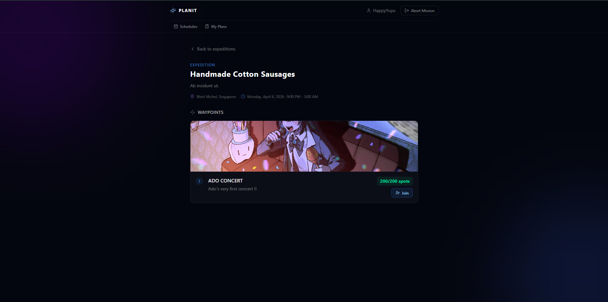
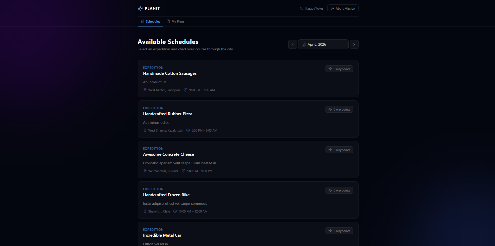
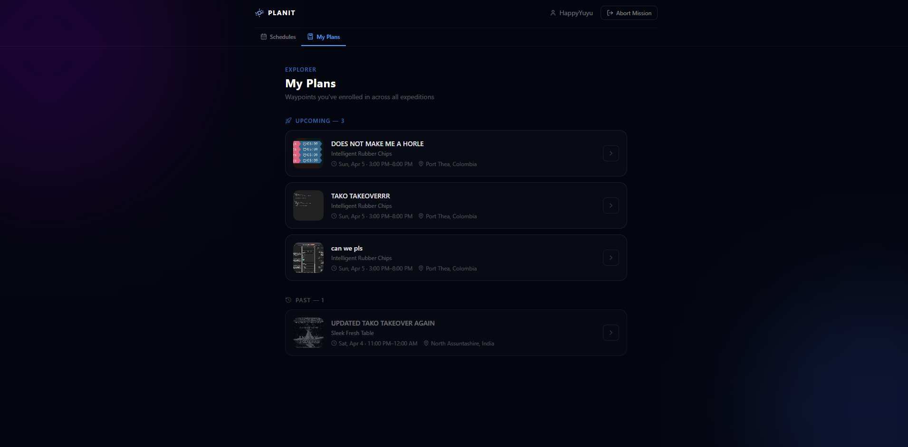
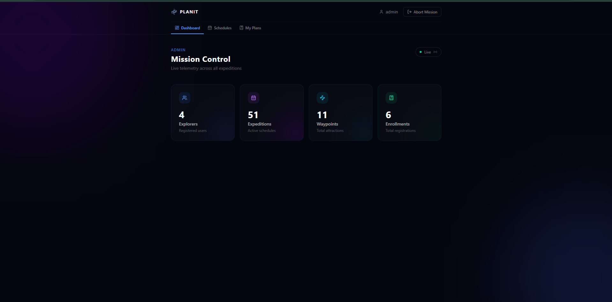

# PlanIt

This is a reworked version of my **technical test submission** for the **SLC Research and Development Team**.

An **online attraction registration platform** built for internal use such as **company outings**. Users browse scheduled attractions, register for one, and receive real-time confirmation. Admins manage schedules, attractions, and monitor live registration counts from a dedicated dashboard.

---

## Tech Stack

### Backend

| Technology             | Reason                                                                                                                                                                  |
| ---------------------- | ----------------------------------------------------------------------------------------------------------------------------------------------------------------------- |
| .NET / ASP.NET Core    | LTS release with excellent performance, minimal APIs, and first-class async support                                                                                     |
| PostgreSQL             | ACID-compliant relational DB; enforces the unique `(UserId, AttractionId)` constraint that is the last line of defense against duplicate registrations                  |
| Entity Framework Core  | Type-safe queries, migrations, soft-delete global filters, and automatic timestamp management                                                                           |
| Redis                  | Dual role: distributed cache (repository decorator layer, 10-min TTL) and idempotency store (30-min TTL per registration attempt)                                       |
| RabbitMQ               | Decouples the HTTP request from the actual DB write; the queue serializes concurrent join attempts so capacity is consumed one at a time without database-level locking |
| ASP.NET Core SignalR   | Pushes real-time capacity updates and registration results to connected clients without polling                                                                         |
| JWT (HS256)            | Stateless authentication; 15-min access tokens + 7-day refresh tokens stored as HttpOnly cookies                                                                        |
| RustFS (S3-compatible) | Self-hosted S3-compatible object storage for attraction images, runs in Docker alongside the app                                                                        |

### Frontend

| Technology  | Reason                                                                                                                            |
| ----------- | --------------------------------------------------------------------------------------------------------------------------------- |
| SvelteKit   | File-based routing, server/client split, and SSR out of the box; minimal runtime overhead compared to React/Vue                   |
| Svelte      | Runes-based reactivity (`$state`, `$derived`, `$effect`) replaces the compiler magic of Svelte 4 with explicit, predictable state |
| TypeScript  | End-to-end type safety across API responses, store state, and component props                                                     |
| TailwindCSS | Utility-first CSS with no runtime; the planetarium design system is expressed entirely in class names                             |
| Bun         | Fast JS runtime and package manager used in both development and the production Docker image                                      |

### Infrastructure

| Technology              | Reason                                                                                                                                     |
| ----------------------- | ------------------------------------------------------------------------------------------------------------------------------------------ |
| Docker / Docker Compose | Single-command local environment: PostgreSQL, Redis, RabbitMQ, RustFS, API, and Web all wired together                                     |
| RabbitMQ healthcheck    | `rabbitmq-diagnostics check_port_connectivity` verifies AMQP port 5672 is open before the API container starts, preventing startup crashes |

---

## Architecture

PlanIt follows **Clean Architecture** with **Domain-Driven Design**. Dependencies flow strictly inward:

```
PlanIt.Api  ──►  PlanIt.Application  ──►  PlanIt.Domain
PlanIt.Infrastructure  ──►  PlanIt.Application
PlanIt.Contracts  ──►  PlanIt.Api
```

| Layer              | Responsibility                                                                                                        |
| ------------------ | --------------------------------------------------------------------------------------------------------------------- |
| **Domain**         | Entities (`User`, `Schedule`, `Attraction`, `Registrant`), value objects, domain exceptions, no external dependencies |
| **Application**    | CQRS commands/queries via MediatR, interface contracts, pipeline behaviors (validation, idempotency)                  |
| **Infrastructure** | EF Core, Redis, RabbitMQ, S3, JWT, BCrypt — all implementing Application interfaces                                   |
| **Api**            | ASP.NET Core controllers, SignalR hubs, exception middleware, Mapster mappings                                        |
| **Contracts**      | Shared C# `record` DTOs for request/response shapes                                                                   |

---

## Screenshots

### Schedule & Attractions



### Schedule Detail



### My Plans



### Admin Dashboard



---

## How the App Handles Each Requirement

### Page Load Time with 1,000+ Concurrent Users

The registration page (`/schedule/[id]`) is designed to stay fast under load through several layers:

**Redis repository caching** — Every repository is wrapped in a caching decorator. Attraction data, capacity counts, and schedule details are stored in Redis with a 10-minute TTL. One thousand users hitting the same schedule page results in a single database query; every subsequent request hits Redis.

```
GET /schedules/:id/attractions
  └─ CachedAttractionRepository
       ├─ cache HIT  → return from Redis (~1 ms)
       └─ cache MISS → query PostgreSQL, populate Redis, return
```

**SvelteKit + svelte-query stale-while-revalidate** — The frontend serves the cached HTML shell immediately and hydrates data client-side. `svelte-query` reuses cached responses for 60 seconds before triggering a background refetch, so re-navigation does not produce a waterfall of API requests.

**Svelte 5 minimal runtime** — The framework compiles to vanilla JavaScript with no virtual DOM diffing. The bundle shipped to users is small, and updates to capacity numbers (received via SignalR) touch only the single reactive `$state` node that changed.

---

### Server Load for Concurrent Requests

The API never becomes the bottleneck for write operations. Registrations are accepted asynchronously:

1. `POST /registrants` returns **202 Accepted** immediately after publishing a message to RabbitMQ — the HTTP thread is freed in under a millisecond.
2. `JoinAttractionConsumer` (a background `IHostedService`) processes the queue with **QoS prefetch = 1**, meaning one message is in-flight at a time. Concurrent requests are naturally serialized by the queue without any database-level locking.
3. Redis idempotency prevents the consumer from doing redundant work if the same user retries.

For read traffic, the Redis cache absorbs the load. Database connections are only opened for cache misses and write operations.

---

### Ease of Use for Client Registration

- Users browse schedules filtered by date from the home page.
- Each attraction card shows the current capacity remaining, updated live via SignalR without any page refresh.
- Clicking "Register" opens a confirmation dialog — one extra tap prevents accidental registration.
- After confirming, the user receives an immediate in-app toast notification (`RegistrationConfirmed` or `RegistrationFailed`) pushed by the server over the existing SignalR connection.
- The "My Plans" page (`/plans`) gives users a single view of every attraction they have joined.

---

### Correct Handling of "First Come, First Served"

Three layers work together to ensure the fastest submission wins:

**Layer 1 — Optimistic pre-check (API)**
`JoinAttractionCommandHandler` reads the cached remaining capacity. If it is already zero, the request is rejected immediately with `AttractionFullException` before anything is queued.

**Layer 2 — Authoritative capacity check (Consumer)**
`JoinAttractionConsumer` re-reads capacity from the source of truth (database, bypassing cache) before creating the `Registrant` row. This is the point where simultaneous requests that passed the pre-check are resolved: the first one to be dequeued writes the row, the rest see capacity = 0 and receive `RegistrationFailed`.

**Layer 3 — Database unique constraint**
The `Registrant` table has a unique index on `(UserId, AttractionId)`. Even if two consumer somehow raced to the insert, the database rejects the second with a constraint violation, caught and converted to `AlreadyRegisteredException`.

RabbitMQ with prefetch = 1 means the consumer processes one registration at a time, making the ordering deterministic: whichever message arrived in the queue first is processed first.

---

### Message to User When Quota Is No Longer Available

The flow on a full attraction:

1. Consumer dequeues the message, checks remaining capacity, finds 0.
2. Calls `IAttractionNotifier.SendRegistrationFailed(userId, "Attraction is full")`.
3. SignalR delivers `RegistrationFailed` to the specific user's connection.
4. Frontend `svelte-french-toast` displays: _"Registration failed — this attraction is now full."_
5. The capacity counter on the attraction card is already showing 0 (updated by the `CapacityUpdated` broadcast that fired when the last slot was taken).

The user never waits for a page reload or polling cycle to discover the bad news.

---

### Handling Capacity Changes During Active Registration

When an admin modifies an attraction's capacity:

- The `UpdateAttraction` command updates the database and **invalidates the Redis cache key** for that attraction's remaining count and the full attraction object.
- The next capacity read (by any consumer or API handler) goes to the database and repopulates the cache with the new ceiling.
- `AdminNotifier.BroadcastStatsUpdate` pushes fresh stats to the admin dashboard via SignalR.
- If capacity is reduced below the current registration count, the existing registrants are not evicted — the constraint is "no new registrations beyond capacity", and the `remaining` value floors at 0.

This means capacity changes take effect immediately for all new registration attempts without any restart or cache warm-up step.

---

## Registration Flow (Full Sequence)

```
User clicks "Register"
        │
        ▼
POST /schedules/{sid}/attractions/{aid}/registrants
  [Idempotency-Key: <uuid>]
        │
        ▼
IdempotencyBehavior ──► Redis: key seen before? ──YES──► return cached result
        │ NO
        ▼
JoinAttractionCommandHandler
  ├─ remaining > 0? ──NO──► throw AttractionFullException (400)
  └─ YES ──► publish JoinAttractionMessage to RabbitMQ
        │
        ▼
HTTP response: 202 Accepted
        │
        ▼                              (async, background)
JoinAttractionConsumer dequeues
  ├─ re-check capacity (DB)
  ├─ capacity = 0? ──► SendRegistrationFailed ──► SignalR ──► user toast
  └─ capacity > 0?
       ├─ INSERT Registrant row
       ├─ cache idempotency result
       ├─ BroadcastCapacityUpdated ──► SignalR ──► all schedule viewers
       └─ SendRegistrationConfirmed ──► SignalR ──► user toast
```

---

## Getting Started

### Prerequisites

- Docker & Docker Compose
- .NET SDK 8.0 (for local development without Docker)
- Bun (for frontend development)

### Run with Docker

```bash
docker compose up --build
```

| Service             | URL                                      |
| ------------------- | ---------------------------------------- |
| Frontend            | http://localhost:5173                    |
| API                 | http://localhost:5254                    |
| Swagger             | http://localhost:5254/swagger            |
| RabbitMQ Management | http://localhost:15672 (planit / planit) |
| RustFS Console      | http://localhost:9001 (planit / planit)  |

### Run Locally (without Docker)

```bash
# Start infrastructure only
docker compose up postgres redis rabbitmq rustfs -d

# Backend
dotnet run --project PlanIt.Api

# Frontend
cd PlanIt.Web
bun install
bun run dev
```

### Seed the Database

```bash
dotnet run --project PlanIt.Api -- --seed
```

---

## Environment Configuration

All development settings live in `PlanIt.Api/appsettings.Development.json`. In Docker, environment variables override these values (ASP.NET Core maps `__` to `:` in key hierarchies).

| Key                                   | Default               | Description                                              |
| ------------------------------------- | --------------------- | -------------------------------------------------------- |
| `ConnectionStrings:DefaultConnection` | PostgreSQL localhost  | Database connection                                      |
| `ConnectionStrings:Redis`             | localhost:6379        | Redis connection                                         |
| `JwtSettings:AccessTokenSecret`       | (dev secret)          | HS256 signing key for access tokens                      |
| `JwtSettings:AccessExpiryMinutes`     | 15                    | Access token lifetime                                    |
| `JwtSettings:RefreshExpiryMinutes`    | 25200 (7 days)        | Refresh token lifetime                                   |
| `S3:Endpoint`                         | http://localhost:9000 | Internal S3 endpoint (used by API for uploads)           |
| `S3:PublicEndpoint`                   | http://localhost:9000 | Public S3 endpoint (used to serve image URLs to clients) |
| `S3:BucketName`                       | planit                | S3 bucket                                                |
| `RabbitMQ:Host`                       | localhost             | RabbitMQ hostname                                        |
